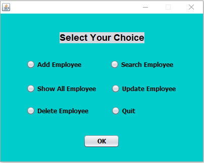
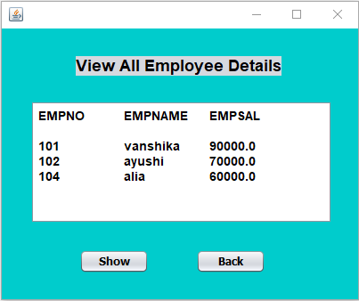
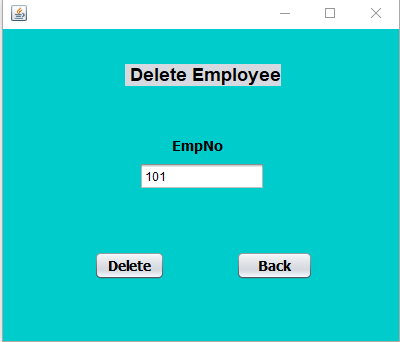

# EmployeesManagementSystem
This repository contains a Java-based Employee Management System designed to manage and maintain employee salary records. The system supports CRUD operations (Create, Read, Update, Delete) and is equipped with a user-friendly GUI built using Swing. The backend utilizes SQL for database operations.
<h1>Built with</h1>

<h1>Features</h1>
<li>Add New Employee: Create new employee records, including salary details.</li>
<li>View Employee Records: Retrieve and display the details of existing employees.</li>
<li>Update Employee Information: Modify existing employee salary details.</li>
<li>Delete Employee Records: Remove employees from the system.</li>
<li>Search Functionality: Easily find specific employee records.</li>
<li>Responsive GUI: A user-friendly interface designed with Swing for seamless interaction.</li>
<h1>Installation</h1>
<li>Clone the repository:</li>
    Copy code 
   "git clone https://github.com/Vanshika1402jain/EmployeesManagementSystem.git"
<li>Set up your SQL database</li>
<li>Configure the database connection:</li>
Update the JDBC connection string in the Java files with your database credentials (host, username, password).
<li>Compile and run the project:</li>
  Use your preferred IDE (e.g., NetBeans,Eclipse, IntelliJ IDEA) to compile and run the project.
<h1>Usage</h1>
Run the system.
Use the GUI to:
Add a new employee with salary details.
Search, update, or delete employee records.
View the database records for real-time updates.
<h1>preview</h1>

<h1>Author</h1>
<h2>Vanshika Jain</h2>
<li><a href="https://github.com/Vanshika1402jain"><b>Github</b></a></li>
<li><a href="https://in.linkedin.com/in/vanshika-jain-70384b252"><b>LinkedIn</b></a> </li>
